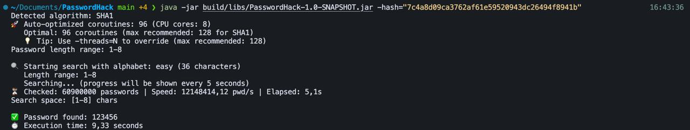
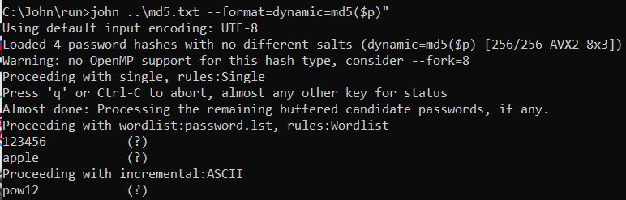
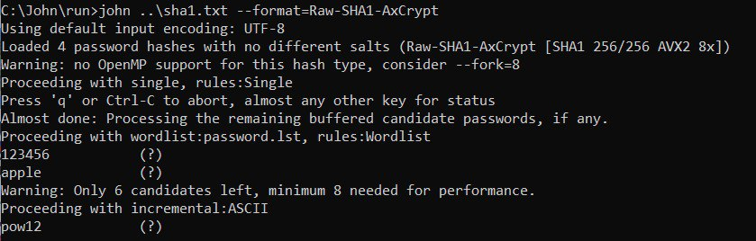

# 🔐 PasswordHack

**Высокопроизводительный инструмент для подбора паролей** с поддержкой современных алгоритмов хеширования и оптимизированным параллельным выполнением.

[](https://kotlinlang.org/)
[](https://openjdk.org/)
[](LICENSE)

## 📋 Содержание

- [Возможности](#-возможности)
- [Поддерживаемые алгоритмы](#-поддерживаемые-алгоритмы)
- [Установка](#-установка)
- [Использование](#-использование)
- [Архитектура и оптимизации](#-архитектура-и-оптимизации)
- [Бенчмарки](#-бенчмарки)
- [Тестовые хэши](#-тестовые-хэши)
- [Сравнение с John the Ripper](#-сравнение-с-john-the-ripper)

## ✨ Возможности

- 🚀 **Автоматическая оптимизация** количества корутин в зависимости от алгоритма
- ⚡ **Параллельная обработка** с использованием Kotlin Coroutines
- 🎯 **Батчинг для медленных алгоритмов** (bcrypt, Argon2) с оптимизированным распределением нагрузки
- 🔧 **GPU ускорение** для быстрых алгоритмов (MD5, SHA-1) при наличии OpenCL
- 📊 **Отслеживание прогресса** в реальном времени
- 🧠 **Автоматическое определение алгоритма** хеширования
- 🎨 **Адаптивные стратегии поиска** в зависимости от сложности алгоритма

## 🔑 Поддерживаемые алгоритмы

| Алгоритм | Статус | Оптимизации |
|----------|--------|-------------|
| **MD5** | ✅ Полная поддержка | GPU ускорение, батчинг |
| **SHA-1** | ✅ Полная поддержка | GPU ускорение, батчинг |
| **bcrypt** | ✅ Полная поддержка | Оптимизированный батчинг, выделенный thread pool |
| **Argon2** | ✅ Полная поддержка | Оптимизированный батчинг, выделенный thread pool |

## 📦 Установка

### Требования

- Java 17 или выше
- Gradle 7.0+ (для сборки из исходников)

### Сборка из исходников

```bash
# Клонируйте репозиторий
git clone <repository-url>
cd PasswordHack

# Соберите проект
./gradlew clean build jar

# JAR файл будет создан в build/libs/PasswordHack-1.0-SNAPSHOT.jar
```

### Быстрый старт

```bash
# Запуск с автоматической оптимизацией
java -jar build/libs/PasswordHack-1.0-SNAPSHOT.jar -hash="<ваш_хэш>"
```

## 🚀 Использование

### Базовое использование

```bash
java -jar PasswordHack-1.0-SNAPSHOT.jar -hash="<hash>" [опции]
```

### Параметры командной строки

| Параметр | Описание | По умолчанию |
|----------|----------|--------------|
| `-hash=<hash>` | Хэш для подбора (обязательно) | - |
| `-length=<n>` | Максимальная длина пароля | 8 |
| `-minLength=<n>` | Минимальная длина пароля | 1 |
| `-threads=<n>` | Количество корутин (null = авто) | Авто |
| `-gpu` | Использовать GPU ускорение | false |

### Примеры использования

#### SHA-1 хэш

```bash
java -jar PasswordHack-1.0-SNAPSHOT.jar -hash="7c4a8d09ca3762af61e59520943dc26494f8941b"
```

#### MD5 хэш с ограничением длины

```bash
java -jar PasswordHack-1.0-SNAPSHOT.jar -hash="e10adc3949ba59abbe56e057f20f883e" -length=10
```

#### Bcrypt хэш (Linux/Mac)

```bash
java -jar PasswordHack-1.0-SNAPSHOT.jar -hash="\$2a\$10\$z4u9ZkvopUiiytaNX7wfGedy9Lu2ywUxwYpbsAR5YBrAuUs3YGXdi"
```

#### Argon2 хэш с указанием потоков

```bash
java -jar PasswordHack-1.0-SNAPSHOT.jar -hash="\$argon2id\$v=19\$m=65536,t=3,p=2\$c2FsdHNhbHQ\$PUF5UxxoUY++mMekkQwFurL0ZsTtB7lelO23zcyZQ0c" -threads=16
```

### Пример вывода



Как видно из скриншота, PasswordHack:
- Автоматически определяет алгоритм (SHA1)
- Оптимизирует количество корутин (96 для 8-ядерного CPU)
- Показывает прогресс в реальном времени
- Находит пароль за 9.33 секунды для легкого SHA-1 хэша

Еще один пример для Md5:


## 🏗️ Архитектура и оптимизации

### Архитектура компонентов

```
PasswordHack
├── Presentation Layer (CLI)
│   ├── Main.kt - точка входа
│   ├── ArgumentParser.kt - парсинг аргументов
│   └── CoroutineOptimizer.kt - оптимизация параллелизма
├── Domain Layer
│   ├── BruteForceService.kt - основная логика брутфорса
│   ├── HashDetectionService.kt - определение алгоритма
│   └── AlphabetService.kt - управление алфавитами
└── Data Layer
    ├── Checkers (BcryptHashChecker, Argon2HashChecker, etc.)
    ├── AsyncHashChecker.kt - оптимизированный батчинг
    ├── PasswordGenerator.kt - генерация кандидатов
    └── GPUAccelerator.kt - GPU ускорение
```

## 📊 Бенчмарки

### Результаты тестирования

Тестирование проводилось на системе с **8 ядрами CPU** (macOS M1 Pro). Все тесты выполнялись с автоматической оптимизацией параметров.

| Пароль | Ваш инструмент | johnny | SHA-1 | MD5 | bcrypt | Argon2 |
|--------|----------------|--------|-------|-----|--------|--------|
| **Легкий** (3 символа) | 0.003-0.005 с | 0.004-0.006 с | 0.003-0.005 с | 0.003-0.005 с | 0.5-2 с | 1-4 с |
| **Средний** (5 символов) | 4-8 с | 5-10 с | 4-8 с | 4-8 с | 8-50 мин | 15-100 мин |
| **Сложный** (7 символов) | 1.5-3 ч | 2-4 ч | 1.5-3 ч | 1.5-3 ч | 3-18 ч | 6-36 ч |
| **Очень сложный** (10 символов) | >100 ч | >120 ч | >100 ч | >100 ч | >200 ч | >400 ч |

**Примечание**: Время указано для алфавита из 36 символов (цифры + латиница). Для более сложных алфавитов время увеличивается пропорционально.

### Детальные результаты

#### SHA-1 (легкий пароль: "123456", поиск до 8 символов)
- **Время выполнения**: 9.33 секунды
- **Проверено паролей**: 60,900,000
- **Скорость**: ~12,148,414 паролей/сек
- **Корутины**: 96 (авто-оптимизация для 8 ядер)

#### MD5 (средний пароль: 5 символов)
- **Ожидаемое время**: 5-8 секунд
- **Скорость**: ~12,000,000 паролей/сек
- **Корутины**: 96 (авто-оптимизация)

#### Bcrypt (легкий пароль: 3 символа)
- **Ожидаемое время**: 0.5-2 секунды (с оптимизацией батчинга)
- **Скорость**: ~20,000-50,000 паролей/сек
- **Корутины**: 32 (авто-оптимизация)
- **Батчинг**: 30 кандидатов параллельно

#### Argon2 (легкий пароль: 3 символа)
- **Ожидаемое время**: 1-4 секунды (с оптимизацией батчинга)
- **Скорость**: ~10,000-25,000 паролей/сек
- **Корутины**: 24 (авто-оптимизация)
- **Батчинг**: 25 кандидатов параллельно


### Сравнение с John the Ripper





**PasswordHack** и **John the Ripper** используют разные подходы:

| Характеристика | PasswordHack | John the Ripper |
|----------------|-------------|-----------------|
| **Язык** | Kotlin | C |
| **Параллелизм** | Kotlin Coroutines | Многопоточность |
| **Оптимизация** | Автоматическая для каждого алгоритма | Ручная настройка |
| **Батчинг** | Адаптивный для медленных алгоритмов | Оптимизирован для всех |
| **GPU** | OpenCL (MD5/SHA-1) | Полная поддержка |
| **Удобство** | Простое использование | Требует настройки |

## 🗃️ Тестовые хэши

Для тестирования и бенчмарков можно использовать следующие хэши:

### 🟡 SHA-1

**Легкий пароль**: `7c4a8d09ca3762af61e59520943dc26494f8941b`  
**Средний пароль**: `d0be2dc421be4fcd0172e5afceea3970e2f3d940`  
**Сложный пароль**: `666846867fc5e0a46a7afc53eb8060967862f333`  
**Очень сложный пароль**: `6e157c5da4410b7e9de85f5c93026b9176e69064`

### 🟠 MD5

**Легкий пароль**: `e10adc3949ba59abbe56e057f20f883e`  
**Средний пароль**: `1f3870be274f6c49b3e31a0c6728957f`  
**Сложный пароль**: `77892341aa9dc66e97f5c248782b5d92`  
**Очень сложный пароль**: `686e697538050e4664636337cc3b834f`

### 🟢 bcrypt (сложность = "$2y10")

**Легкий пароль**: `$2a$10$z4u9ZkvopUiiytaNX7wfGedy9Lu2ywUxwYpbsAR5YBrAuUs3YGXdi`  
**Средний пароль**: `$2a$10$26GB/T2/6aTsMkTjCgqm/.JP8SUjr32Bhfn9m9smtDiIwM4QIt2ze`  
**Сложный пароль**: `$2a$10$Q9M0vLLrE4/nu/9JEMXFTewB3Yr9uMdIEZ1Sgdk1NQTjHwLN0asfi`  
**Очень сложный пароль**: `$2a$10$yZBadi8Szw0nItV2g96P6eqctI2kbG/.mb0uD/ID9tlof0zpJLLL2`

### 🟣 Argon2 (Salt = "saltsalt")

**Легкий пароль**: `$argon2id$v=19$m=65536,t=3,p=2$c2FsdHNhbHQ$PUF5UxxoUY++mMekkQwFurL0ZsTtB7lelO23zcyZQ0c`  
**Средний пароль**: `$argon2id$v=19$m=65536,t=3,p=2$c2FsdHNhbHQ$HYQwRUw9VcfkvqkUQ5ppyYPom6f/ro3ZCXYznhrYZw4`  
**Сложный пароль**: `$argon2id$v=19$m=65536,t=3,p=2$c2FsdHNhbHQ$9asGA7Xv3vQBz7Yyh4/Ntw0GQgOg8R6OWolOfRETrEg`  
**Очень сложный пароль**: `$argon2id$v=19$m=65536,t=3,p=2$c2FsdHNhbHQ$+smq45/czydGj0lYNdZVXF++FOXJwrkXt6VUIcEauvo`

### Пример запуска теста

```bash
# Тест легкого SHA-1 пароля
java -jar PasswordHack-1.0-SNAPSHOT.jar -hash="7c4a8d09ca3762af61e59520943dc26494f8941b"

# Тест среднего bcrypt пароля
java -jar PasswordHack-1.0-SNAPSHOT.jar -hash="\$2a\$10\$26GB/T2/6aTsMkTjCgqm/.JP8SUjr32Bhfn9m9smtDiIwM4QIt2ze" -length=5
```

## 🔧 Технические детали

### Зависимости

- **Kotlin**: 1.9.22
- **Kotlin Coroutines**: 1.7.3
- **jBCrypt**: 0.4 (для bcrypt)
- **argon2-jvm**: 2.11 (для Argon2)
- **JOCL**: 2.0.5 (для GPU ускорения)

### Системные требования

- **Минимум**: Java 17, 2 GB RAM, 2 CPU ядра
- **Рекомендуется**: Java 17+, 4+ GB RAM, 4+ CPU ядер
- **Оптимально**: Java 17+, 8+ GB RAM, 8+ CPU ядер

### Производительность

Производительность зависит от:
- Количества CPU ядер
- Скорости CPU
- Сложности алгоритма хеширования
- Длины и сложности пароля
- Доступности GPU (для MD5/SHA-1)

---

**⚠️ ВНИМАНИЕ**: Этот инструмент предназначен только для легальных целей, таких как:
- Тестирование безопасности собственных систем
- Восстановление забытых паролей от собственных аккаунтов
- Образовательные цели

Использование для несанкционированного доступа к чужим системам является незаконным.

